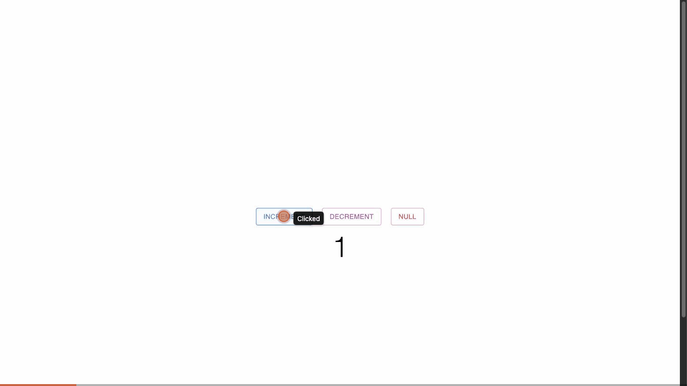

# increase-decrease

A small React counter built with Material-UI: increment, decrement (never below
zero) and reset to zero.



*Increment raises the count, Decrement lowers it (stopping at zero), and Null resets it back to zero.*

## Features

- **Increment** — raise the count by one.
- **Decrement** — lower the count by one, stopping at zero (never negative).
- **Null** — reset the count back to zero.
- The current value is shown large and centered.

## Technologies

- React 17
- Material-UI (MUI v5)

## Run it

```bash
npm install
npm start      # opens http://localhost:3000
```

`npm test` and `npm run build` work as usual.

## How it works

The count is a single piece of React state (`useState`). Each button is a guarded
update: increment adds one, decrement subtracts one only while the count is above
zero, and Null sets it back to zero. The value renders in an MUI `Typography`
heading.

Bootstrapped with Create React App.

## License

This project is licensed under the MIT License — see the [LICENSE](LICENSE) file.
